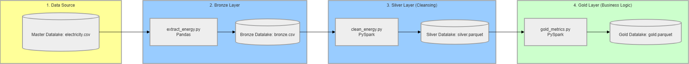

# Victoria Energy Analytics Pipeline

## Project Overview

The Victoria Energy Analytics project processes and cleans historical electricity market data to extract actionable business metrics. Utilizing Apache Airflow and PySpark, the system automates the ingestion of raw energy prices and demand data using a structured Bronze-Silver-Gold architecture to ensure data quality and consistency.

The final output provides reliable datasets optimized for Business Intelligence tools, enabling stakeholders to:

- Analyze energy cost trends
- Identify peak consumption periods
- Monitor demand fluctuations
- Support data-driven strategies for optimizing energy expenses

---

## Key Features

### End-to-End Data Processing
Processes historical Victoria energy market data from raw CSV files into a structured analytics-ready format.

### Automated Data Cleansing
Uses PySpark to:
- Standardize date formats
- Correct data types
- Handle missing values
- Improve overall data quality for reporting and analysis

### Pre-calculated Business Metrics
Generates aggregated metrics such as:
- Total energy costs
- Peak demand periods
- Consumption trends

The final Gold layer acts as a business-ready data mart optimized for downstream reporting and BI dashboards.

### Reliable Task Scheduling
Automates the entire workflow using Apache Airflow to ensure data pipelines run consistently without manual intervention.

---

## Tech Stack

| Category | Technology |
|---|---|
| Orchestration | Apache Airflow |
| Data Processing | PySpark, Pandas |
| Storage Format | Parquet |
| Infrastructure | Docker, Docker Compose |

---

## Data Source

This project utilizes historical electricity market data from Victoria, Australia.

The dataset is retrieved using the `download_data.py` utility script, which downloads raw CSV files containing:
- Electricity pricing data
- Power demand data
- Time-series interval records

---

## Project Structure

```bash
├── dags/                                 # Airflow DAGs and core logic
│   ├── scripts/                          # Processing scripts
│   │   ├── spark/
│   │   │   ├── __init__.py
│   │   │   ├── clean_energy.py           # PySpark script for Data Quality (Silver)
│   │   │   └── gold_metrics.py           # PySpark script for Business Insights (Gold)
│   │   ├── __init__.py
│   │   └── extract_energy.py             # Script for raw data extraction (Bronze)
│   ├── victoria_bronze_dag.py            # Orchestrates Bronze layer workflow
│   ├── victoria_gold_dag.py              # Orchestrates Gold layer workflow
│   └── victoria_silver_dag.py            # Orchestrates Silver layer workflow
├── .gitignore                            # Excludes .env and temporary files
├── Dockerfile                            # Custom Docker image configuration
├── docker-compose.yaml                   # Infrastructure setup for Airflow & Spark
├── download_data.py                      # Utility script to download initial raw data
└── requirements.txt                      # Python dependencies
```

---

## Pipeline Architecture

### Bronze Layer
- Extracts raw CSV files
- Stores original source data
- Preserves raw historical records

### Silver Layer
- Cleans and standardizes datasets
- Applies data quality validation
- Handles null values and schema corrections

### Gold Layer
- Creates aggregated business metrics
- Produces analytics-ready datasets
- Optimized for BI and reporting tools

---

## Workflow Diagram



## Project Setup

### Prerequisites

Ensure the following tools are installed on your system:

- Docker
- Docker Compose
- Git

---

## Installation

### 1. Clone the Repository

```bash
git clone https://github.com/your-username/electricity-price-pipeline.git
cd electricity-price-pipeline
```

### 2. Download Initial Raw Data

Run the utility script to fetch the required dataset before starting the workflow.

```bash
python download_data.py
```

### 3. Start the Docker Environment

Build the custom Docker image and start the Airflow infrastructure.

```bash
docker-compose up -d
```

---

## Access Apache Airflow

Open your browser and navigate to:

```text
http://localhost:8080
```

### Default Credentials

| Username | Password |
|---|---|
| airflow | airflow |

---

## Running the Pipelines

Inside the Airflow UI:

1. Unpause the following DAGs:
   - `victoria_bronze_dag`
   - `victoria_silver_dag`
   - `victoria_gold_dag`

2. Trigger the DAGs to execute the workflows.

---

## Stopping the Environment

```bash
docker-compose down
```

---

## Output

The pipeline produces:
- Cleaned Parquet datasets
- Aggregated business metrics
- Analytics-ready tables for BI tools
